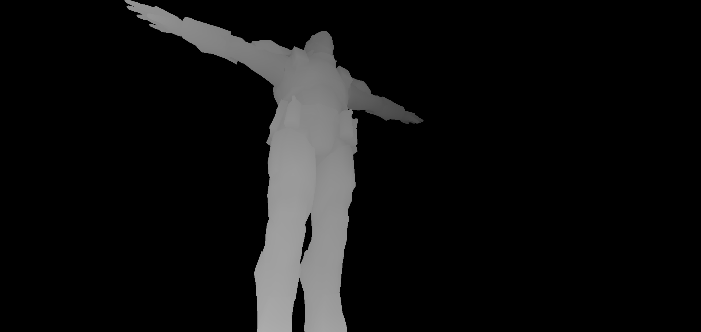
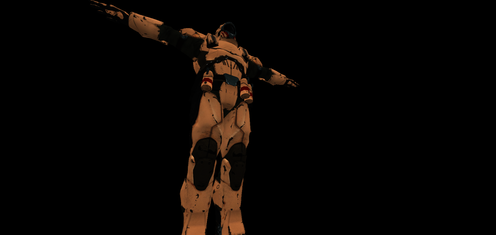
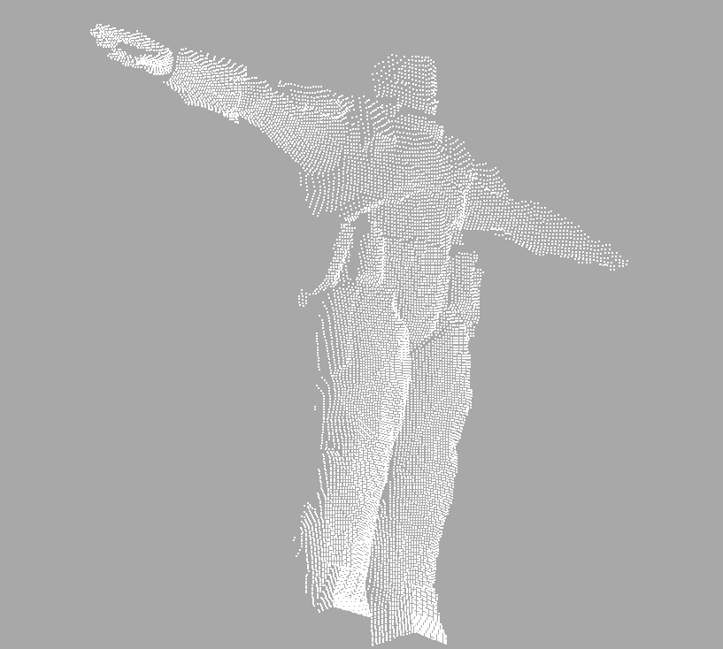

# threejs-depth-image-test

This project demonstrates how to use [three.js](https://threejs.org/) to render a 3D scene with a depth texture, visualize the depth buffer, and export both depth images and point clouds. It supports loading GLTF and PLY models, and provides a GUI for switching view modes and exporting data.

## Features

- Renders a 3D scene using three.js with depth texture support.
- Visualizes depth buffer as a grayscale image.
- Exports the depth visualization as a PNG image.
- Exports the scene as a PCD (Point Cloud Data) file.
- Supports loading GLTF (`.glb`) and PLY (`.ply`) models.
- Interactive camera controls (OrbitControls).
- GUI for changing depth format/type, MSAA samples, view mode, and exporting.

## Getting Started

### Prerequisites

- A modern web browser with WebGL2 support.
- No build step required; just open `index.html` in your browser.
- The following files should be present in the project directory:
  - `index.html`
  - `main.css`
  - `three.js-r175/` (three.js library and examples)
  - `Soldier.glb` (or your own GLTF model)
  - `bunny.ply` (or your own PLY model)

### Usage

1. Open `index.html` in your web browser.
2. Use the GUI (top-right) to:
   - Change depth format/type and MSAA samples.
   - Switch between Depth and RGB view modes.
   - Export the current depth visualization as an image.
   - Export the current view as a point cloud (PCD file).
3. Use mouse to orbit, pan, and zoom the camera.

### File Structure

```
threejs-depth-image-test/
├── index.html
├── main.css
├── README.md
├── Soldier.glb
├── bunny.ply
└── three.js-r175/
    ├── build/
    │   └── three.module.js
    └── examples/
        └── jsm/
            ├── controls/
            ├── loaders/
            └── libs/
```
### Gallery




### Notes

- If your browser does not support `WEBGL_depth_texture`, the demo will not work.
- You can replace `Soldier.glb` and `bunny.ply` with your own models.
- The exported PCD file can be opened with point cloud viewers such as [CloudCompare](https://www.danielgm.net/cc/).

## Credits

- Based on [three.js](https://threejs.org/) and examples by @mattdesl.
- Uses [lil-gui](https://github.com/georgealways/lil-gui) for the GUI and [stats.js](https://github.com/mrdoob/stats.js/) for FPS display.

## License

MIT License (see [LICENSE](LICENSE) if present)